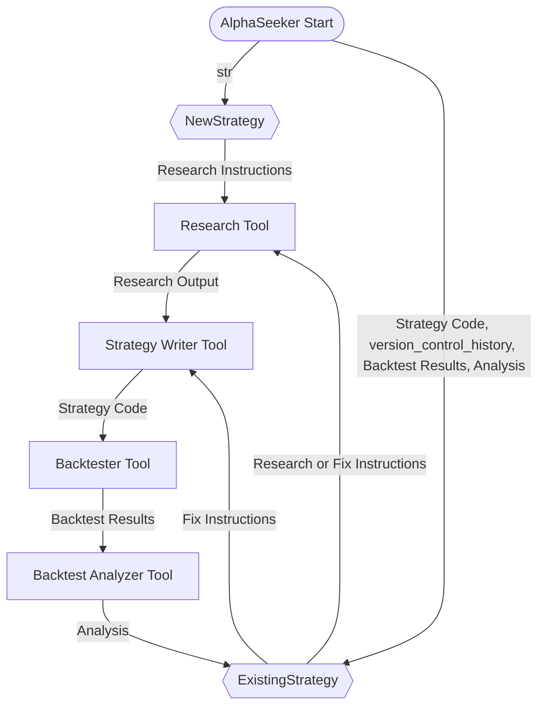

# AlphaSeeker Workflow Architecture

## Overview
AlphaSeeker is a **meta-agent** that orchestrates the development and refinement of algorithmic trading strategies. It does this by dynamically invoking a set of **agentic tools**—specialized, callable components that perform research, strategy writing, backtesting, and analysis. The system supports two modes:
- **NewStrategy**: Starts from research ideas to develop a new strategy.
- **ExistingStrategy**: Improves or pivots existing strategies based on backtest results.

---

## AlphaSeeker Meta-Agent and Its Tools

- **AlphaSeeker (Meta-Agent, Coordinator & Decision Maker)**
  - Initiates and controls the workflow.
  - Analyzes ideas, strategies, and backtest results.
  - Decides whether to:
    - Proceed with minor strategy fixes.
    - Initiate new research.
    - Finalize the strategy.
  - Dynamically calls the following agentic tools as needed:

- **Research Tool**
  - Conducts research based on AlphaSeeker's instructions.
  - Gathers data, papers, or insights to inform strategy development.

- **Strategy Writer Tool**
  - Implements or modifies trading strategies based on research or AlphaSeeker's instructions.

- **Backtester Tool**
  - Runs simulations of strategies on historical data.

- **Backtest Analyzer Tool**
  - Evaluates backtest results.
  - Provides insights on performance, risk, and potential improvements.

---

## Workflow Loop

### 1. System Start
- User or scheduler starts the system.
- **Inputs:**

- AlphaSeeker is initialized in either **NewStrategy** or **ExistingStrategy** mode.
  - **NewStrategy Mode:** receives input variable `str` (strategy idea or seed concept).
  - **ExistingStrategy Mode:** receives inputs `Strategy Code`, `version_control_history`, `Backtest Results`, and `Analysis`.

### 2. AlphaSeeker (Initial Step)
- **NewStrategy Mode:**
  - Loads research ideas JSON.
  - Asks: *"What is the most promising new strategy idea to pursue?"*
  - Generates clear research instructions.
  - Passes instructions to **Research Agent**.

- **ExistingStrategy Mode:**
  - Loads existing strategy, previous backtest results, and analysis.
  - Asks: *"Is a minor fix sufficient, or is new research needed?"*
  - Decides to:
    - Pass fix instructions to **Strategy Writer**, or
    - Pass research instructions to **Research Agent**.

### 3. Research Agent (Should be an agentic tool that AlphaSeeker can call as needed.)
- Conducts research per instructions.
- Outputs insights, data, or hypotheses.
- Passes results to **Strategy Writer**.

### 4. Strategy Writer (Should be an agentic tool that AlphaSeeker can call as needed.)
- Develops or modifies the strategy.
- Saves the updated strategy.
- Passes it to **Backtester**.

### 5. Backtester (Should be an agentic tool that AlphaSeeker can call as needed.)
- Runs the updated strategy on historical data.
- Saves backtest results.
- Passes results to **Backtest Analyzer**.

### 6. Backtest Analyzer (Should be an agentic tool that AlphaSeeker can call as needed.)
- Analyzes backtest results.
- Generates performance metrics and improvement suggestions.
- Passes analysis to **AlphaSeeker**.

### 7. AlphaSeeker (Decision Point)
- Reviews strategy, backtest results, and analysis.
- Asks: *"Is a minor fix sufficient, or is new research needed?"*
- Decides to:
  - Loop back to **Strategy Writer** with fix instructions, or
  - Loop back to **Research Agent** with new research instructions.

### 8. Loop Continues
- The process repeats until AlphaSeeker determines the strategy is satisfactory or terminates the loop.

---

## Data Flow Summary

- **Ideas JSON** → AlphaSeeker (NewStrategy)
- **Strategy + Backtest Results + Analysis** → AlphaSeeker (ExistingStrategy)
- **AlphaSeeker Instructions** → Research Agent or Strategy Writer
- **Research Output** → Strategy Writer
- **Strategy Code** → Backtester
- **Backtest Results** → Backtest Analyzer
- **Analysis** → AlphaSeeker

---

## Suggested Modular Design

- **Meta-Agent Class: `AlphaSeeker`**
  - `mode: NewStrategy | ExistingStrategy`
  - `decide_next_step()`
  - `generate_research_instructions()`
  - `generate_fix_instructions()`
  - `coordinate()`
  - Calls the following tools dynamically as needed:

- **Agentic Tool: `ResearchTool`**
  - `conduct_research(instructions)`

- **Agentic Tool: `StrategyWriterTool`**
  - `write_or_modify_strategy(research_output or fix_instructions)`

- **Agentic Tool: `BacktesterTool`**
  - `run_backtest(strategy_code)`

- **Agentic Tool: `BacktestAnalyzerTool`**
  - `analyze_results(backtest_results)`

- **Main Loop**
  - Initialize AlphaSeeker with mode.
  - While not done:
    - AlphaSeeker decides next step.
    - Call appropriate tool.
    - Pass outputs along the pipeline.
    - Loop based on AlphaSeeker's decision.

---
## Updated Mermaid Diagram with Input Variables

